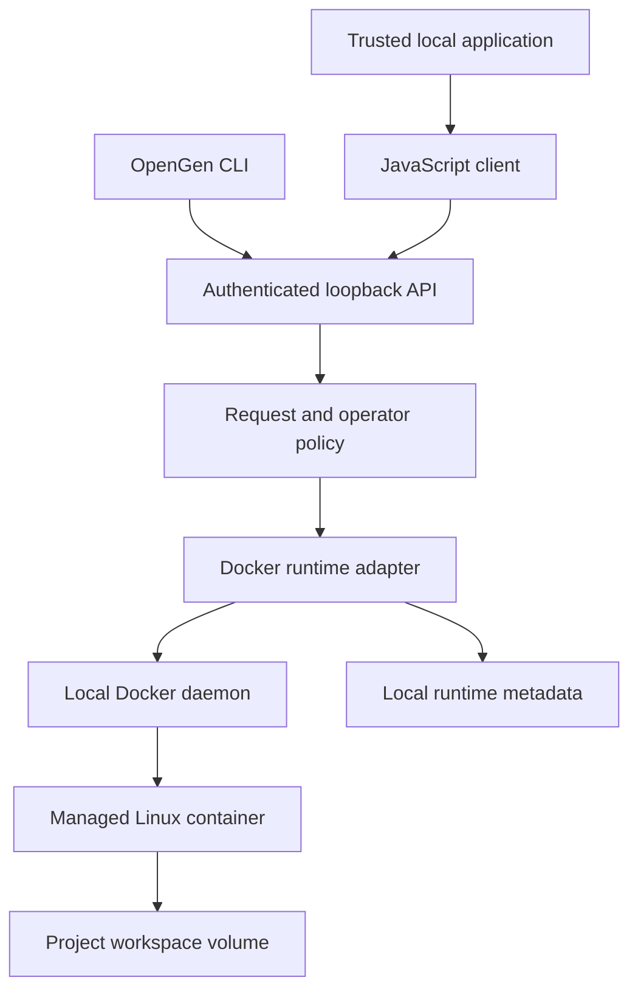

# Architecture

OpenGen provides local execution and workspace management. Application-level
planning, agent memory, model routing, billing, connectors, and collaboration
belong to its consumers.

## Request path

The native Docker adapter is the only implemented backend. It invokes Docker
with argument arrays, never host shell interpolation. A workload executes inside
its container; Docker failure does not cause execution to fall back to the host.

## Ownership and trust

The server serves one local owner. Every route requires the same owner token.
`projectId` associates a sandbox with a project and guards against accidental
cross-project operations; it is not a multi-user authorization system. A holder
of the owner token can operate every project owned by that runtime.

The operator selects available profiles and decides whether bridge networking
is allowed. API requests cannot choose arbitrary images, environment variables,
host paths, privileged mode, Docker daemon flags, or Docker socket mounts.

OpenGen labels and records its resources and checks ownership before operating
on them. Workspaces use named Docker volumes rather than caller-selected host
directories. Docker control-plane access remains powerful: the server and host
operator are trusted, while commands and files inside a sandbox are untrusted.

## State and lifecycle

| Data | Owner and lifetime |
| --- | --- |
| Owner token and operator configuration | Local OpenGen state directory; outside containers |
| Sandbox identity, project association, image identity, and resource references | Persisted runtime metadata |
| Source files, outputs, and workspace home directory | A managed volume at `/workspace` |
| Processes, root filesystem runtime changes, and temporary files | Container lifecycle |
| Agent conversation, task checkpoints, model credentials, and billing | Consumer application; outside OpenGen |

Creation starts a container from an operator-approved local image. The image is
resolved to its local content identity for the sandbox record. Stop terminates
execution while retaining the workspace. Start launches the container's configured
command again; it does not restore process memory or resume a stopped command.
Reset replaces the container while retaining workspace files; it does not undo
file changes. Delete requires an explicit workspace-deletion acknowledgment and
removes the managed resources for that sandbox.

Runtime metadata survives a service restart. Status operations inspect Docker
state instead of assuming saved status is current. A missing or externally
modified resource is a recovery condition, not permission to adopt another
container or run a host command.

A local ownership lock permits one runtime process per state directory. Graceful
close cancels active execution, drains admitted operations, and releases the lock.
It does not delete workspaces or stop every previously started background
container. A client must use sandbox stop when it wants execution to end.

## Execution and previews

Commands use argv arrays with a workspace-relative working directory. Execution
has a deadline and bounded output. A command timeout stops the entire sandbox,
including its other processes; this prevents a detached child from continuing
after only the local Docker CLI has been killed. Concurrent independent tasks
should use separate sandboxes.

Networking defaults to `none`. Optional preview ports require operator-enabled
network access, bind to `127.0.0.1`, and use Docker-assigned host ports. The workload
must listen on `0.0.0.0` inside its container. Preview content is untrusted and the
preview port is not protected by the OpenGen API bearer token.

## Deliberate first-release limits

There is no microVM boundary, tenant scheduler, distributed lock manager, preview
authentication gateway, browser automation engine, credential broker, or hosted
service. Docker containers share their Linux host kernel. A future adapter must
preserve lifecycle, file, execution, and policy semantics and declare capabilities
it cannot provide. A common API alone is not evidence of equivalent isolation.

See [SECURITY.md](SECURITY.md), [API.md](docs/API.md), and
[INTEGRATION.md](docs/INTEGRATION.md).
